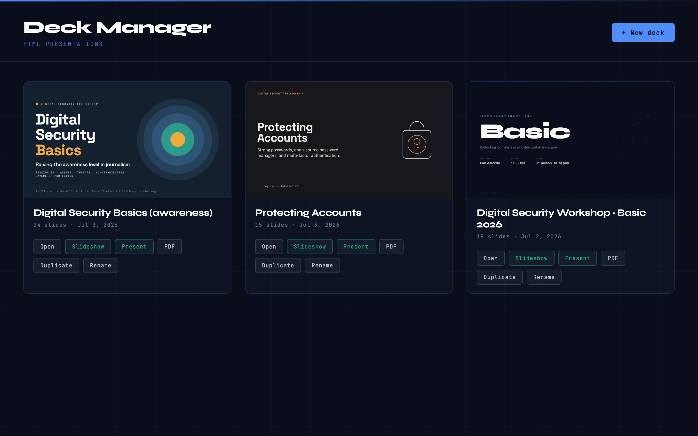
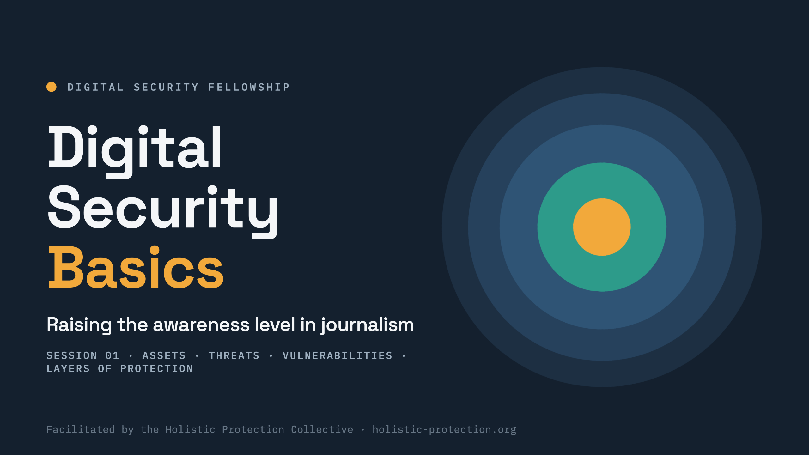

# Deck Manager

A local, zero-dependency tool for creating and managing HTML presentations
(built on the `<deck-stage>` web component) the way you would in Keynote —
library, inline editing, presenter view, a clean screen-shareable slideshow
window, and one-click PDF export. macOS native app + plain-browser modes.

Requires [Node.js](https://nodejs.org) (any recent version). The native app
also needs macOS + the Xcode Command Line Tools (`xcode-select --install`).

Every deck is one manageable card; **Slideshow** opens a chromeless,
full-bleed window you can screen-share on its own:

## Your decks live wherever you want

The tool is decoupled from your presentations. Point it at any folder of decks
via the `DECK_MANAGER_ROOT` environment variable (browser mode) or **File ▸
Open Workshop Folder…** (native app). It scans that folder for HTML decks and
lists them — just drop a deck's `.html` (ideally in its own subfolder with its
assets) into the folder and refresh.

The library groups decks by their folder, with a section per folder — so you
can organise by course, language, or topic. Each card has a **Move…** action
that relocates the deck into any folder under the decks root (type a new name
to create one). Moving is safe by design: a deck travels together with its
assets only when its folder contains nothing but the deck and web assets;
folders holding other materials (documents, videos, other decks) are treated
as shared and only the deck's `.html` moves.

Two kinds of deck are recognised:

- **`<deck-stage>` decks** — the fully-featured format: inline editing,
  thumbnail rail, presenter view, synced slideshow window, and clean PDF export.
- **External decks** — any other self-contained HTML presentation (its own
  slide engine, e.g. a one-file deck from another tool). These are listed with
  an `EXTERNAL` badge; you can **Open** them, pop them into their own **Window**
  to screen-share, export a best-effort **PDF**, and Duplicate / Rename / Delete
  them. Deep editing is deck-stage-only — the deck keeps its own design and
  controls untouched (the manager only overlays a small, fade-out toolbar).

## Start

- **Native app** — copy `native/deck-manager.conf.example` to
  `native/deck-manager.conf` and set `WORKSHOP_DIR` (your decks folder) and,
  optionally, `SIGN_IDENTITY` (a Developer ID for signing). Then
  `cd native && ./build.sh` and open `DeckManager.app`. It starts the server,
  shows the library, and opens the slideshow/presenter as **separate macOS
  windows** you can share individually in Zoom/Meet. (Ad-hoc-signed builds may
  need a right-click ▸ Open the first time.)
- **Browser** — `DECK_MANAGER_ROOT=/path/to/decks node server.mjs`, then open
  <http://localhost:4321>. Or edit `Deck Manager.command` and double-click it.

## The library (home page)

Every presentation found in this folder appears as a card with a live
thumbnail. From there you can **Open** (edit), **Present**, **Duplicate**,
**Rename**, or create a **New deck** from the starter template. Single-file
bundled decks exported from claude.ai show an **Import to edit** button that
extracts them into an editable folder (the original file is untouched).

## Editing a deck (open it through the library)

- **Thumbnail rail** (left): click to jump, drag to reorder. Right-click a
  thumbnail for *Skip / Move / Duplicate / New slide… / Delete*.
- **New slide…** opens a gallery of layout templates
  (`deck-manager/templates/slides/`). Add your own `.html` snippets there —
  one `<section>` per file.
- **Double-click any text** on a slide to edit it in place. Blur or press
  Esc to finish.
- **Click any element to select it** — outline + style bar (font size ±, text
  color, alignment, duplicate, delete; bring-forward/backward for floating
  objects). Drag to move: floating objects move freely; flow-layout elements
  get a visual offset so the slide's responsive layout never breaks. Arrow
  keys nudge (⇧ = bigger steps), `⌫` deletes, `⌘D` duplicates, Esc deselects.
- **＋ Text** adds a floating text box; **＋ Image** adds a picture — or just
  **drag & drop an image file onto the slide** (or paste one from the
  clipboard). Images are copied into the deck's `assets/` folder; drag the
  corner handle to resize.
- **Notes** (toolbar or `N`): edit presenter notes for the current slide.
  Notes are stored as `data-speaker-notes` on the slide, so they travel
  with it when you reorder or duplicate.
- Every change is **saved to the HTML file automatically** ("Saved ✓" pill,
  bottom right). The last 20 versions of each deck are kept in a
  `.deck-manager-backups` folder next to your decks.

For bigger layout/design changes, edit the deck's HTML directly (or ask
Claude Code) — the file is plain HTML, one `<section>` per slide.

## Presenting

**Presenter view** — click **Present** (or press `P`): current slide, next
slide, notes, clock, and an elapsed timer that starts on your first advance.

**Play Slideshow** — click **Slideshow** (or press `S`) to open a clean,
full-bleed window with no rail, toolbar, or browser chrome. This is the
window you **share in Zoom/Meet** (share *that window* specifically). Press
`F` for fullscreen; the cursor auto-hides. It **follows the presenter
automatically** — move to a slide in the presenter view and the shared window
mirrors it — and you can also arrow through the slideshow window directly.
Sync runs through the server, so it works across separate windows, browsers,
and the native app's windows alike.

## PDF export

Click **PDF** on a library card, the **⤓ PDF** toolbar button, or the native
app's **File ▸ Export Current Deck as PDF…**. The server renders the deck with
headless Chrome/Brave — one 1920×1080 page per slide, fonts intact. If no
Chromium-based browser is installed it falls back to the browser's
Print → Save as PDF dialog.

Decks remain fully portable: double-clicking the deck's `.html` file plays it
standalone (no server, no editing chrome).

## Native app (`native/`)

`DeckManagerApp.swift` + `Info.plist` + `build.sh` build a
`DeckManager.app` (SwiftUI + WKWebView) with `swiftc` — no Xcode project. It
spawns the Node server (found next to the app), shows the library, and opens
Slideshow/Presenter as individual native windows (each shareable on its own in
Zoom). **File ▸ Open Workshop Folder…** re-points it at a different decks
folder. Needs Node installed (found automatically in the usual locations).
Quitting the app stops the server.

## Pieces

| File | Role |
|---|---|
| `server.mjs` | zero-dependency local server: library, save API, backups, SSE sync bus, PDF export |
| `library.html` | the home page |
| `edit-mode.js` | editing layer injected into decks served via the manager |
| `presenter.js` / `presenter.html` | presenter view, slideshow window, cross-window sync (SSE) |
| `unbundle.mjs` | import claude.ai single-file bundles (also a CLI) |
| `templates/` | new-deck starter + slide layout gallery |
| `native/` | SwiftUI `DeckManager.app` + `build.sh` |
